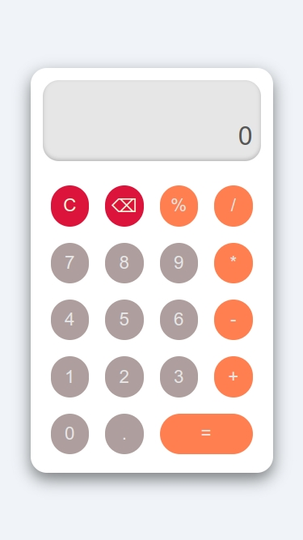

# 🧮 Simple Calculator

A lightweight and clean **calculator web app** built using **HTML**, **CSS**, and **Vanilla JavaScript**.  
It performs basic arithmetic operations such as **addition (+)**, **subtraction (-)**, **multiplication (\*)**, **division (/)**, and **percentage (%)**.

---

## ⚙️ Features

- Supports basic operations: `+`, `-`, `*`, `/`, `%`
- Real-time result display
- Syntax error validation
- Simple, modern, and lightweight UI
- 100% responsive — works on both mobile and desktop

---

## 🔍 How `simpleCalc()` Works

The `simpleCalc()` function handles all the calculation logic.

1. **Splits** the input expression into tokens (numbers and operators)
2. **Checks** for syntax errors (like consecutive operators)
3. **Converts** percentage (%) values into decimal form
4. **Performs** operations by order of precedence:
   - Multiplication (`*`) and Division (`/`) first
   - Then Addition (`+`) and Subtraction (`-`)
5. **Returns** the final numeric result

### 🧩 Example:

```js
simpleCalc("10+5*2"); // Output: 20
simpleCalc("50%*200"); // Output: 100
```

---

## 📁 Project Structure

```
calculator/
│
├── index.html       # Main page (UI)
├── style.css        # Styling and layout
├── main.js          # JavaScript logic
├── img.jpeg         # Calculator preview image
└── README.md        # Documentation file
```

---

## 🧭 How to Use

1. Open **index.html** in your browser.
2. Click the on-screen buttons to enter an expression.
3. Press `=` to calculate the result.
4. Use the following controls:
   - `C` → Clear input and output
   - `⌫` → Delete the last character

---

## 🛠️ Technologies Used

| Technology           | Purpose                      |
| -------------------- | ---------------------------- |
| **HTML5**            | Structure of the page        |
| **CSS3**             | Styling and layout           |
| **JavaScript (ES6)** | Core logic and interactivity |

---

## 👨‍💻 Author

**Othmane** — A passionate Computer Science student learning web development and software engineering.

---

## 🪪 License

This project is **open-source** and **free** for educational or personal use.

---

## 📸 Screenshots

Below is a preview of the calculator interface:


