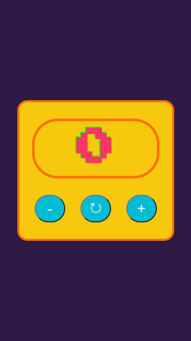

# Counter Project

A simple **counter** application built with **HTML, CSS, and JavaScript**.  
You can increase, decrease, or reset the counter. This project is **educational**.

---

## How to Use

1. Open `index.html` in your browser.
2. Use the buttons:
   - `+` → increase the counter
   - `-` → decrease the counter
   - `↻` → reset the counter to 0

---

## Screenshot

---

## Project Files

- `index.html` → main HTML file  
- `style.css` → styling  
- `main.js` → JavaScript logic  
- `img.jpeg` → screenshot of the app  
- `README.md` → this file  

---

## Notes

- Counter wraps to 0 if it reaches **99** (max) or **-99** (min).  
- Uses **Press Start 2P** font for a retro look.  
- Fully responsive for different screen sizes.