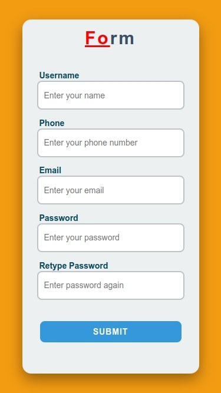
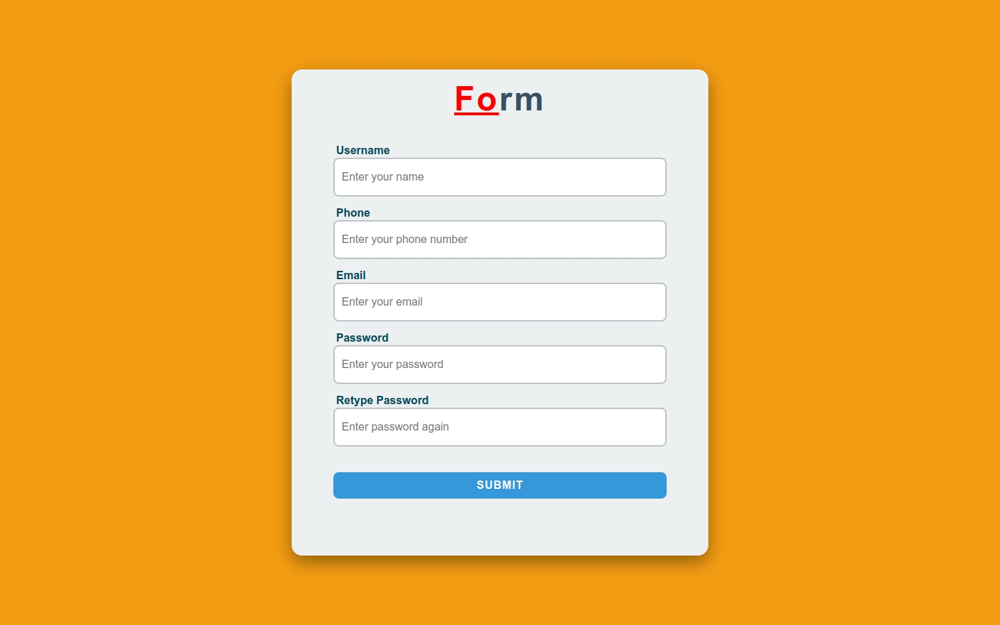

# FormValidator

A **sign-up form project** with real-time input validation using **JavaScript libraries**.  
This is an **educational project** for learning how to validate form inputs, check password strength, and provide instant feedback to users.

---

## 📝 Project Files

| File | Description |
|------|-------------|
| `index.html` | Main HTML file containing the form structure. |
| `style.css` | Styling for the form and messages. |
| `main.js` | JavaScript file for input validation and password strength checking. |
| `img1.jpeg` | Screenshot of the form on a **mobile device**. |
| `img2.jpeg` | Screenshot of the form on a **desktop/laptop**. |

---

## 🔧 Features

- Real-time **username validation** (letters only, 3–20 characters).  
- Real-time **phone number validation** (digits only, exactly 10 digits).  
- Real-time **email validation** using `validator.js`.  
- Real-time **password strength check** using `zxcvbn.js`.  
- Real-time **password confirmation check**.  
- Clear **feedback messages** displayed under each input.  
- Prevent form submission if any input is invalid.  

---

## 📚 Libraries Used

- [`validator.js`](https://cdnjs.com/libraries/validator) → for email validation.  
- [`zxcvbn.js`](https://github.com/dropbox/zxcvbn) → for password strength evaluation.  

---

## 📸 Screenshots

**Mobile:**  
  

**Desktop:**  
  

---

## 🎯 Learning Goals

- Understand **form input validation** in JavaScript.  
- Learn how to use **external libraries** for validation and security.  
- Provide **interactive user feedback** while typing.  
- Build **responsive and user-friendly forms**.