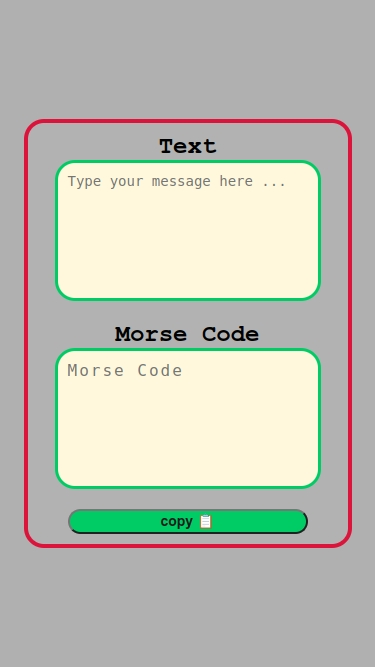

# Morse Code Converter

This is a simple project to **convert text to Morse code**.  
It is created for learning **HTML, CSS, and JavaScript**.

---

## How to Use

1. Open `index.html` in your browser.
2. Type your message in the **Text** area.
3. The Morse code will appear in the **Morse Code** area.
4. Click the **copy** button to copy the Morse code.

---

## Screenshots

**Main Interface**  

---

## Project Files

- `index.html` → main HTML file  
- `style.css` → styling  
- `main.js` → JavaScript for conversion  
- `img1.jpeg`, `img2.jpeg` → screenshots  
- `README.md` → this file  

---

## Notes

- This project is **educational**.  
- Supports letters, numbers, and some punctuation.