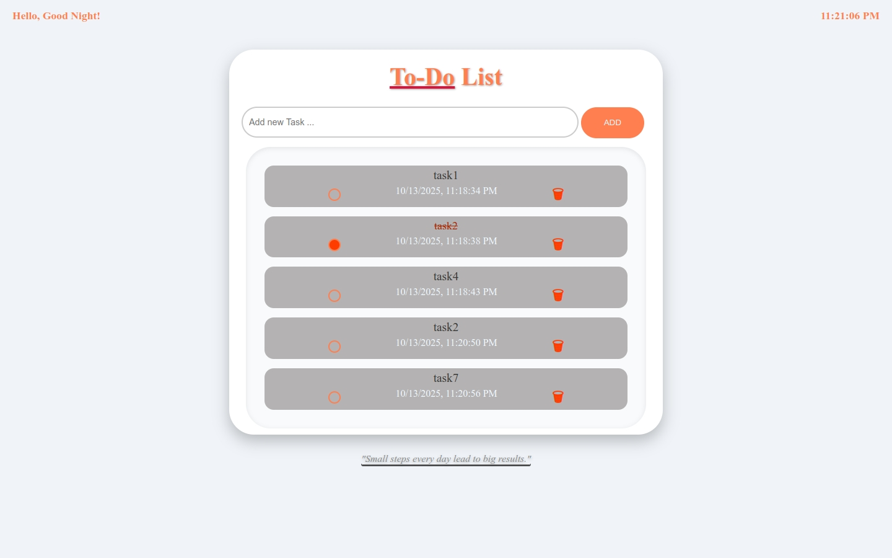

# To-Do List App

A clean and simple To-Do List application built with HTML, CSS, and JavaScript. Users can add tasks, mark them as completed, and delete them, with all data saved in the browser’s localStorage for persistence across page reloads.

---

## Overview
This project is part of my personal Front-End Development learning journey.
It demonstrates practical DOM manipulation, event handling, and data persistence using localStorage.

---

## Features
- Quickly add new tasks.
- Mark tasks as completed (adds strikethrough).
- Delete tasks permanently.
- Persistent storage using localStorage.
- Tasks remain after page reload.
- Optional protection from HTML injection with escapeHtml().

---

## Project Structure
The project contains the following files:
- `index.html` → Main application page.
- `style.css` → Styling and layout.
- `main.js` → Application logic and interactivity.
- `img.jpg` → Screenshot of the app.
- `README.md` → Project documentation.

---

## How It Works
1. **Initialization**: The app checks localStorage for existing tasks; if none are found, an empty array is created.
2. **Adding a Task**: Users type a task in the input field and click the Add button. The task is saved in localStorage with a timestamp and status.
3. **Displaying Tasks**: All saved tasks are dynamically rendered in the list on page load.
4. **Marking as Done**: Each task has a checkbox; checking it updates the task’s status and visually adds a strikethrough.
5. **Deleting Tasks**: The delete button removes the task from both the DOM and localStorage using its unique timestamp.

---

## How to Use
1. Clone or download the repository from GitHub.
2. Open `index.html` in your browser.
3. Type a task in the input box and click **Add**.
4. Check the box to mark a task as done, or click **Delete** to remove it.

---

## App Preview

---

## Future Improvements
- Add task categories or tags.
- Allow editing tasks.
- Implement Dark Mode.
- Add due dates with notifications.
- Enable drag-and-drop task reordering.
- Separate JS and CSS files for cleaner structure.

---

## Lessons Learned
- DOM manipulation: creating, appending, and removing elements dynamically.
- Handling user input and events (click, input, delegation).
- Persisting data using localStorage.
- Managing dates and timestamps in ISO format.
- Writing clean and reusable JavaScript functions.

---

## Author
Othmane – Computer Science Student | Front-End Development Learner  
*"Small daily improvements lead to big results."*