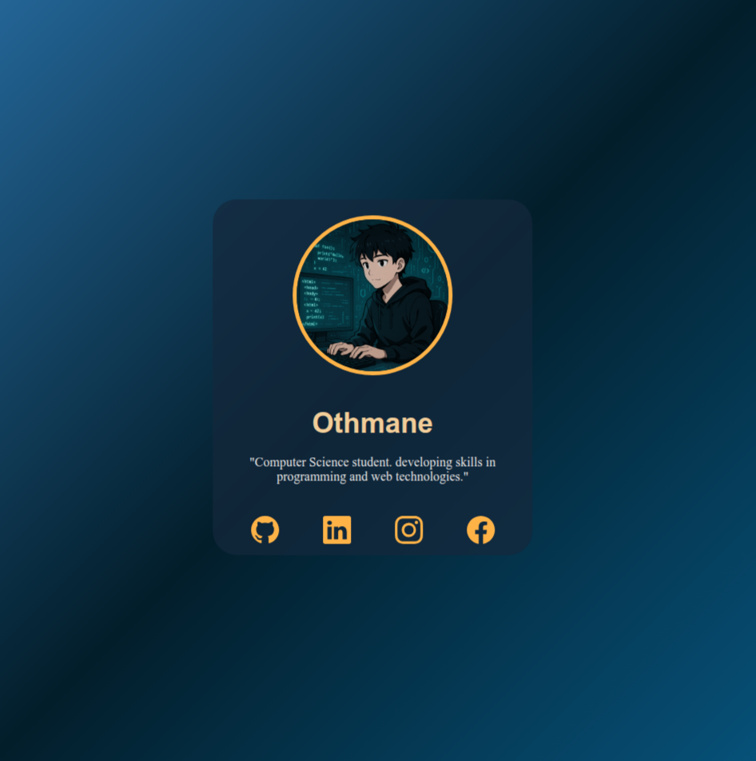

# Personal Profile Card Project

A simple **personal profile card** built with **HTML & CSS**.  
No JavaScript is used. This project is **educational**.

---

## How to Use

1. Open `index.html` in your browser.
2. You will see a profile card with:
   - A **profile picture**
   - Your **name** and a short **description**
   - Social media links (GitHub, LinkedIn, Instagram, Facebook)

3. Hover over elements to see small **interactive effects** (scaling, color changes, rotation).

---

## Screenshot

---

## Project Files

- `index.html` → main HTML file  
- `style.css` → styling  
- `img/screenshot.png` → screenshot of the profile card  
- `README.md` → this file  

---

## Notes

- Fully responsive design.  
- Uses **hover effects** for better interactivity.  
- Fonts and colors can be customized as needed.